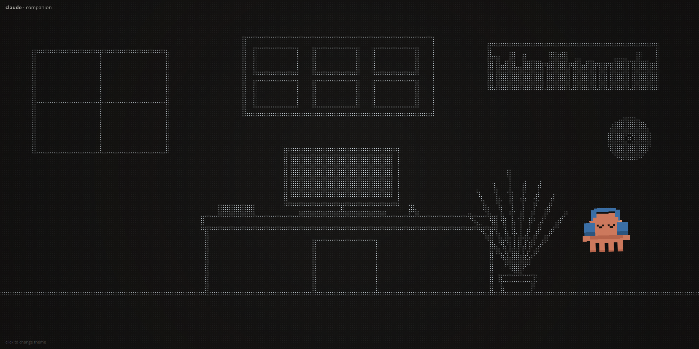

# Claude Companion

A tiny desktop companion that lives in your browser. A chunky, headphone-wearing
blob wanders a dot-matrix world, picks a scene to match the time of day, and speaks
short partner-like lines in a speech bubble — including a live mirror of whatever
Claude Code just said in your terminal.

It's a single HTML file plus two small Python scripts. No build step, no framework,
no dependencies.



> If the image above is missing, drop a screenshot at `docs/themes.png` — it's
> optional and the app doesn't need it.

---

## What it does

- **A hand-drawn creature** — orange blob, blue headphones, sleepy eyes, four
  stubby legs. It waddles around with a planted-foot gait, bobs, blinks, and faces
  the way it walks. Everything is procedural (drawn frame by frame on a canvas), so
  it never repeats exactly.
- **Eight genuinely distinct scenes** — not one scene recolored eight times. Each is
  its own little world, rendered as a halftone dot field over a dark background.
- **Time-of-day theming** — it auto-picks a scene that fits the current hour and
  quietly rotates within that mood.
- **Live chat mirror** — at the end of every Claude Code turn, the companion shows
  the conversational lines from that reply (skipping code, paths, and commands),
  one bubble at a time, then drifts back to idle small-talk. Nothing is pushed by
  hand — the screen follows the conversation on its own.
- **Live activity narration** — while a turn is still running, the companion
  narrates the work in parallel: as each tool fires it flashes a matching line —
  *"reading a file…"*, *"running a command…"*, *"searching the code…"*,
  *"editing a file…"*, *"checking the web…"*, *"a workflow is running…"*. So the
  screen stays in step with the terminal instead of only speaking at the end.
- **Context-aware status lines** — it also reacts to what you change in the session:
  switch model and it says *"now running on …"*, change `/effort` or set a `/goal`
  and it announces what changed. All detected automatically from the session —
  nothing to configure.

---

## The eight themes

| Time of day | Themes |
|-------------|--------|
| Morning     | **morning window** (arched window, rising sun, curtains, sill plant) · **quiet study** (bookshelves, round clock, hanging vines, ferns) |
| Day         | **work desk** (monitor, pinboard of notes, bookshelf, daylight window) · **plant studio** (a jungle of ferns and trailing vines) |
| Evening     | **evening cafe** (counter, bar stools, pendant lamps, espresso machine, menu board) · **reading nook** (armchair, floor lamp, side table, rug) |
| Night       | **city night** (lit skyline, moon, scattered stars) · **starry night** (moon, dense starfield, rolling hill silhouette) |

Click anywhere to cycle through them manually.

### Two looks

The scenes ship in two render styles — same creature, same behaviour, same live feed:

- **`index.html`** — the original halftone look: each scene drawn white-on-black and
  dithered into a dot-matrix field.
- **`index-v1.html`** — a flat, bright, high-contrast take: solid color blocks, soft
  glows, crisp shapes, no halftone.

The setup below works for either — just serve the file you prefer.

---

## How it works

```
              ┌─ Stop hook ──────▶ reply lines + model/effort/goal events ─┐
 Claude Code ─┤                                                            ├─▶ feed.json ◀─polls─ index.html
  (terminal)  └─ PreToolUse hook ─▶ live activity ("reading a file…" …) ────┘   (small JSON)      (canvas app)
                  (both slots run bridge.py)
```

- **`index.html`** — the whole app. A canvas render loop draws the scene, the
  creature, and the speech bubble. Every 500 ms it polls `feed.json`; when the
  contents change it queues the new lines and types them out one by one.
- **`feed.json`** — the hand-off file. Shape: `{"id": N, "lines": [...], "src": "..."}`.
  The `id` bumps on every new turn so the page knows there's something fresh; `src`
  is the source message's uuid so a turn is never shown twice. (Auto-generated at
  runtime — see *.gitignore* below.)
- **`bridge.py`** — one script wired into two Claude Code hook slots:
  - As a **Stop hook** it fires when an assistant turn ends, reads the last message
    from the session transcript, keeps only the sentence-like lines (drops fenced
    code, shell commands, bare paths, and anything that isn't mostly letters —
    Hindi/Devanagari included), and writes up to four of them into `feed.json`. It
    also prepends a **context event** when something changed this turn: a model
    switch (from `message.model`), or an `/effort` / `/goal` command (from the
    transcript's `<command-name>` markers).
  - As a **PreToolUse hook** it fires the instant *any* tool starts and flashes a
    matching live line — reading a file, running a command, searching, editing,
    fetching the web, running a workflow — so the screen narrates the work in
    parallel while the turn is still going. Repeats of the same activity are
    debounced so a run of reads doesn't spam.
  Both are detected automatically — no configuration, and each change is announced
  once (deduped via small `model` / `cmd` keys the script keeps in `feed.json`).
- **`push.py`** — a manual override. Lets you put any line(s) on screen right now,
  mid-turn, without waiting for the hook. One argument = one bubble line.

### Why it stays out of your way

- The bridge dedups by the source message's uuid, so a turn is processed exactly
  once and turns with nothing to say exit immediately (no busy-wait that would
  delay your next prompt).
- It never throws into your session — any error just exits quietly with status 0.
- The page handles a missing or empty `feed.json` gracefully (it simply shows idle
  lines until the first real turn).

---

## Setup

### 1. Serve the folder

The page fetches `feed.json` over HTTP, so open it through a server rather than as a
`file://` path. Any static server works:

```bash
cd claude-companion
python3 -m http.server 8777
```

Then open <http://localhost:8777/> and leave it on a second monitor.

### 2. Wire up the Claude Code hooks

Add the bridge to your Claude Code settings (`~/.claude/settings.json`), pointing at
wherever you cloned this repo:

```json
{
  "hooks": {
    "Stop": [
      {
        "hooks": [
          { "type": "command", "command": "python3 /path/to/claude-companion/bridge.py" }
        ]
      }
    ],
    "PreToolUse": [
      {
        "matcher": "*",
        "hooks": [
          { "type": "command", "command": "python3 /path/to/claude-companion/bridge.py" }
        ]
      }
    ]
  }
}
```

The **Stop** hook alone gives you the chat mirror plus the model / `/effort` / `/goal`
event lines. The **PreToolUse** entry (matcher `"*"` = every tool) adds the live
activity narration — reading, running commands, searching, editing, workflows — so
the screen keeps step with the terminal instead of only speaking at the end. Skip it
if you'd rather keep things quiet. From then on, the companion follows along
automatically.

### 3. (optional) Push a line yourself

```bash
python3 push.py "all done"
python3 push.py "line one" "line two" "line three"   # each arg = one bubble line
```

If you serve `feed.json` from a different location, point both scripts at it with the
`COMPANION_FEED` environment variable.

---

## Controls & URL options

| Action | How |
|--------|-----|
| Change theme | Click anywhere on the page |
| Force a specific theme | `?t=N` (0–7, indexes the theme list) |
| Pretend it's a different hour | `?h=NN` (0–23, drives time-of-day selection) |

Reduced-motion preferences are respected — the film-grain animation and automatic
theme rotation switch off for `prefers-reduced-motion: reduce`.

---

## Project structure

```
claude-companion/
├── index.html      # the app — canvas creature, scenes, speech bubble, feed polling
├── index-v1.html   # same app, flat/bright render (solid scenes, no halftone)
├── bridge.py       # Claude Code Stop hook: reply -> feed.json (automatic)
├── push.py         # manual: write a line to feed.json right now
├── feed.json       # runtime hand-off file (auto-created; git-ignored)
└── README.md
```

---

## Built with

- **HTML5 Canvas 2D** + **vanilla JavaScript** — no framework, no build, no
  dependencies. The render loop runs on `requestAnimationFrame`; the scenes are
  drawn white-on-black and then converted to a halftone dot field per frame.
- **Python 3 standard library only** — `bridge.py` and `push.py` import nothing
  outside the stdlib (`json`, `re`, `unicodedata`, …).
- **Claude Code hooks** — the `Stop` hook is the glue that lets the companion follow
  the conversation.

No package manager, no `node_modules`, nothing to install — clone it and serve it.

---

## License

MIT — do whatever you like with it.
